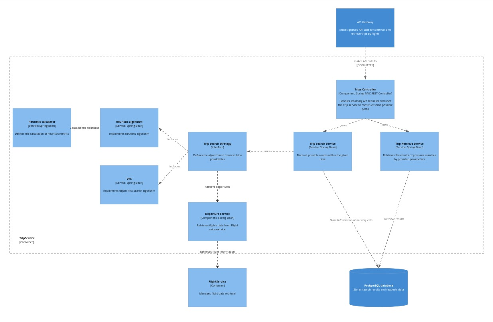

# Trip Microservice

## Introduction
The 'Trip' microservice is part of a larger project to find "Chained trip" between two airports. This documentation covers the technical details of this microservice only.  
[The overall project description](https://medium.com/@vidime.sa.buduci.rok/explore-europe-by-plane-using-this-tool-0cb52ac69b8b).

## Purpose Overview
The microservice looks for all feasible routes which satisfy the given parameters. This is the main logical core of the project designed to find adequate routes effectively.

## Technologies Used
- Java
- Spring Boot
- Gradle

## Architecture Design


### Description
The architecture design shows the interaction between the user, the Trip microservice, and other components like the Trip Service and the Departure Service. The Trip Service utilizes modified DFS algorithm or Heuristic traversal algorithm depending on search time to find feasible paths, and the Departure Service retrieves flight data from the Departure microservice.

## Endpoints

### Get Trips
#### URL
`GET /v1/trips`

#### Description
Constructs several feasible routes within the given criteria. Requires UI-significant amount of time.

#### Parameters
| Name               | Type    | Required | Default    | Description                                                |
|--------------------|---------|----------|------------|------------------------------------------------------------|
| `origin`           | String  | Yes      | None       | The IATA code of the departure airport                     |
| `destination`      | String  | No       | `origin`   | The IATA code of the destination airport                   |
| `departureAt`      | String  | Yes      | None       | The date to start the trip in the format `yyyy-MM-dd`      |
| `returnBefore`     | String  | No       | 3000-01-01 | The date to end the trip before in the format `yyyy-MM-dd` |
| `budget`           | double  | Yes      | None       | Maximum amount of money spent on trips                     |
| `maxStay`          | int     | No       | 1          | Maximum days between two flights                           |
| `minStay`          | int     | No       | 1          | Minimum days between two flights                           |
| `schengenOnly`     | boolean | No       | false      | If `true`, only includes flights within the Schengen Area  |
| `timeLimitSeconds` | int     | No       | 10         | Working time for an algorithm to find feasible trips       |


#### Responses
- **200 OK**
    - **Description**: Successfully found at least one feasible path.
    - **Body**:
        ```json
        [
          {
            "totalPrice": "double",
            "totalFlights": "int",
            "uniqueCities": "int",
            "uniqueCountries": "int",
            "departureAt": "ISO 8601 date-time",
            "arrivalAt": "ISO 8601 date-time",
            "tripSchedule": [
              {
                "flightNumber": "string (IATA airline designator followed by numeric identifier)",
                "departureAt": "ISO 8601 date-time",
                "originAirportName": "String",
                "originAirportCode": "IATA code",
                "originCountryCode": "ISO 3166 country code",
                "destinationAirportName": "String",
                "destinationAirportCode": "IATA code",
                "destinationCountryCode": "ISO 3166 country code",
                "price": "double",
                "currencyCode": "ISO 4217 currency code"
              }
              ...
            ]
          }
          ...
        ]
        ```
- **204 No Content**
    - **Description**: No feasible routes found.
    - **Body**: `null`
- **400 Bad Request**
    - **Description**: Missing or invalid parameters.
    - **Body**: `null`
- **500 Internal Server Error**
    - **Description**: An unexpected error occurred on the server.
    - **Body**: `null`
#### Example request
```bash
curl -X GET "http://localhost:60001/v1/trips?origin=BTS&destination=BTS&departureAt=2024-07-28&budget=200&maxStay=2&continue"
```
#### Example successful response
```json
[
  {
    "totalPrice": 199.09,
    "totalFlights": 11,
    "uniqueCities": 9,
    "uniqueCountries": 5,
    "departureAt": "2024-07-30T09:45:00",
    "arrivalAt": "2024-08-15T23:00:00",
    "tripSchedule": {
      "tripSchedule": [
        {
          "flightNumber": "FR5042",
          "departureAt": "2024-07-30T09:45:00",
          "originAirportName": "Bratislava",
          "originAirportCode": "BTS",
          "originCountryCode": "sk",
          "destinationAirportName": "Leeds Bradford",
          "destinationAirportCode": "LBA",
          "destinationCountryCode": "gb",
          "price": 14.99,
          "currencyCode": "EUR"
        },
        {
          "flightNumber": "FR157",
          "departureAt": "2024-08-01T07:50:00",
          "originAirportName": "Leeds Bradford",
          "originAirportCode": "LBA",
          "originCountryCode": "gb",
          "destinationAirportName": "Dublin",
          "destinationAirportCode": "DUB",
          "destinationCountryCode": "ie",
          "price": 14.99,
          "currencyCode": "GBP"
        },
        {
          "flightNumber": "FR16",
          "departureAt": "2024-08-03T05:45:00",
          "originAirportName": "Dublin",
          "originAirportCode": "DUB",
          "originCountryCode": "ie",
          "destinationAirportName": "Newcastle",
          "destinationAirportCode": "NCL",
          "destinationCountryCode": "gb",
          "price": 14.99,
          "currencyCode": "EUR"
        },
        {
          "flightNumber": "FR21",
          "departureAt": "2024-08-04T19:00:00",
          "originAirportName": "Newcastle",
          "originAirportCode": "NCL",
          "originCountryCode": "gb",
          "destinationAirportName": "Dublin",
          "destinationAirportCode": "DUB",
          "destinationCountryCode": "ie",
          "price": 14.99,
          "currencyCode": "GBP"
        },
        {
          "flightNumber": "FR1860",
          "departureAt": "2024-08-06T20:25:00",
          "originAirportName": "Dublin",
          "originAirportCode": "DUB",
          "originCountryCode": "ie",
          "destinationAirportName": "Paris Beauvais",
          "destinationAirportCode": "BVA",
          "destinationCountryCode": "fr",
          "price": 14.99,
          "currencyCode": "EUR"
        },
        {
          "flightNumber": "FR8883",
          "departureAt": "2024-08-08T17:15:00",
          "originAirportName": "Paris Beauvais",
          "originAirportCode": "BVA",
          "originCountryCode": "fr",
          "destinationAirportName": "Milan Malpensa",
          "destinationAirportCode": "MXP",
          "destinationCountryCode": "it",
          "price": 14.99,
          "currencyCode": "EUR"
        },
        {
          "flightNumber": "FR8884",
          "departureAt": "2024-08-09T19:15:00",
          "originAirportName": "Milan Malpensa",
          "originAirportCode": "MXP",
          "originCountryCode": "it",
          "destinationAirportName": "Paris Beauvais",
          "destinationAirportCode": "BVA",
          "destinationCountryCode": "fr",
          "price": 26.1,
          "currencyCode": "EUR"
        },
        {
          "flightNumber": "FR2895",
          "departureAt": "2024-08-10T07:10:00",
          "originAirportName": "Paris Beauvais",
          "originAirportCode": "BVA",
          "originCountryCode": "fr",
          "destinationAirportName": "Turin",
          "destinationAirportCode": "TRN",
          "destinationCountryCode": "it",
          "price": 14.99,
          "currencyCode": "EUR"
        },
        {
          "flightNumber": "FR873",
          "departureAt": "2024-08-12T19:25:00",
          "originAirportName": "Turin",
          "originAirportCode": "TRN",
          "originCountryCode": "it",
          "destinationAirportName": "Naples",
          "destinationAirportCode": "NAP",
          "destinationCountryCode": "it",
          "price": 29.99,
          "currencyCode": "EUR"
        },
        {
          "flightNumber": "FR3562",
          "departureAt": "2024-08-13T11:50:00",
          "originAirportName": "Naples",
          "originAirportCode": "NAP",
          "originCountryCode": "it",
          "destinationAirportName": "Milan Bergamo",
          "destinationAirportCode": "BGY",
          "destinationCountryCode": "it",
          "price": 20.41,
          "currencyCode": "EUR"
        },
        {
          "flightNumber": "FR4642",
          "departureAt": "2024-08-15T23:00:00",
          "originAirportName": "Milan Bergamo",
          "originAirportCode": "BGY",
          "originCountryCode": "it",
          "destinationAirportName": "Bratislava",
          "destinationAirportCode": "BTS",
          "destinationCountryCode": "sk",
          "price": 17.66,
          "currencyCode": "EUR"
        }
      ]
    }
  }
] 
```
## How to run
### Prerequisites 
- Java 21
- Gradle
- Docker
### Run script
```bash
#!/bin/bash
# Clone the repository
git clone https://github.com/xbiletskyi/TripService
cd TripService

# Build the Docker image
docker build -t tripservice:latest .

# Run the FindRoute container
docker run -d -p 60001:8080 --name tripservice tripservice:latest

# Display running containers
docker ps
```